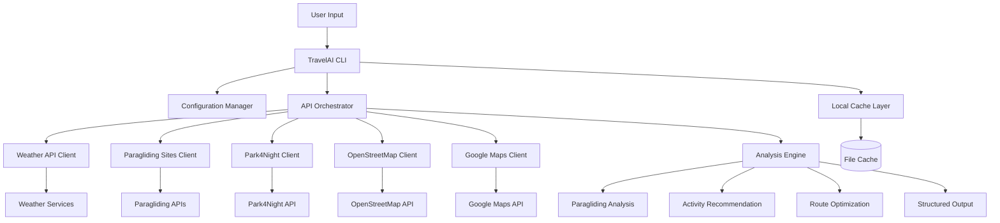
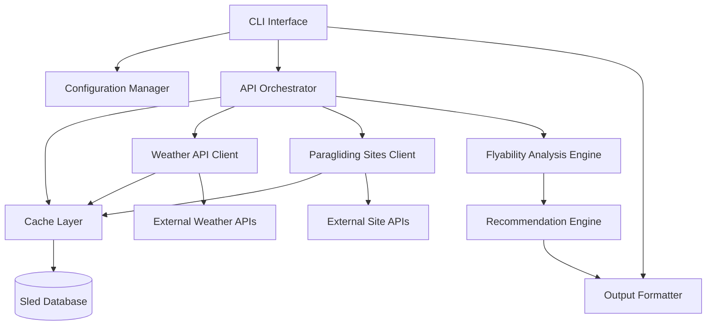
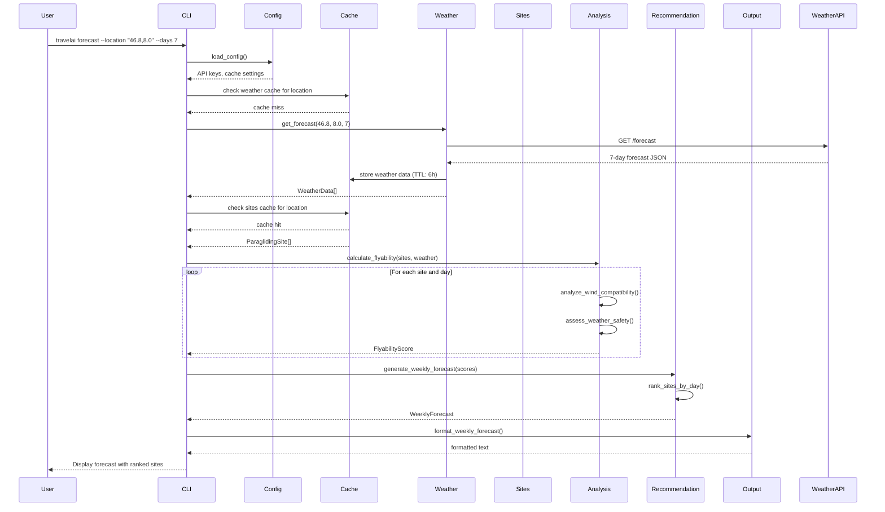

# TravelAI Architecture Document

## Introduction

This document outlines the overall project architecture for TravelAI, including backend systems, shared services, and non-UI specific concerns. Its primary goal is to serve as the guiding architectural blueprint for AI-driven development, ensuring consistency and adherence to chosen patterns and technologies.

**Relationship to Frontend Architecture:**
If the project includes a significant user interface, a separate Frontend Architecture Document will detail the frontend-specific design and MUST be used in conjunction with this document. Core technology stack choices documented herein (see "Tech Stack") are definitive for the entire project, including any frontend components.

### Starter Template or Existing Project

N/A - Greenfield project. This is a new Rust CLI application built from scratch without existing starter templates or boilerplate. The architecture is designed specifically for the paragliding intelligence and travel planning use case.

### Change Log

| Date | Version | Description | Author |
|------|---------|-------------|---------|
| 2025-11-29 | v1.0 | Initial architecture document for TravelAI CLI system | Winston (Architect) |

## High Level Architecture

### Technical Summary

TravelAI is designed as a high-performance Rust CLI application that orchestrates multiple external APIs to deliver intelligent travel planning recommendations. The architecture follows a monolithic approach for MVP simplicity while maintaining clear internal modularity for future scalability. The system integrates weather forecasting, paragliding site databases, accommodation platforms, and mapping services through a unified caching and analysis engine. Core architectural patterns include synchronous API orchestration, intelligent caching strategies, and modular analysis engines that support the primary use case of paragliding-focused adventure travel planning with comprehensive itinerary generation.

### High Level Overview

**Architectural Style:** Monolithic CLI Application with modular internal architecture
**Repository Structure:** Monorepo containing the single Rust binary with clear internal component separation
**Service Architecture:** Single-process application with synchronous API coordination and local caching
**Primary Data Flow:** User input → Location resolution → Sequential API queries → Intelligent analysis → Unified recommendations → Structured output
**Key Architectural Decisions:**
- Rust ecosystem for performance, safety, and cross-platform compatibility
- Synchronous reqwest for API operations (simplicity over async complexity)
- Local caching to minimize API calls and improve response times
- Modular analysis engines for different activity types (paragliding, general activities, accommodation)
- Configuration-driven API management for maintainability

### High Level Project Diagram



### Architectural and Design Patterns

- **Synchronous API Orchestration:** Sequential API calls with proper error handling and timeout management - _Rationale:_ Simpler code, easier debugging, and adequate performance for CLI use case with fast APIs
- **Repository Pattern:** Abstract data access for different API types with consistent interfaces - _Rationale:_ Enables testing with mocks and future API provider changes without affecting business logic
- **Caching Layer Pattern:** Multi-level caching (in-memory + file-based) with TTL and invalidation strategies - _Rationale:_ Critical for API rate limiting compliance and offline capability requirements
- **Command Pattern:** CLI command structure with clear separation of concerns - _Rationale:_ Supports extensible command set and clear user interface as system grows
- **Strategy Pattern:** Pluggable analysis engines for different activity types - _Rationale:_ Allows specialized logic for paragliding vs general activities while maintaining consistent interfaces
- **Circuit Breaker Pattern:** Graceful degradation when external APIs are unavailable - _Rationale:_ Ensures system reliability and user-friendly error handling per NFR4

## Tech Stack

### Cloud Infrastructure
- **Provider:** None (Self-contained CLI application)
- **Key Services:** N/A (Standalone binary with local caching)
- **Deployment Regions:** Cross-platform binary distribution (GitHub Releases or similar)

### Technology Stack Table

| Category | Technology | Version | Purpose | Rationale |
|----------|------------|---------|---------|-----------|
| **Language** | Rust | 1.75+ | Primary development language | Performance, memory safety, excellent CLI ecosystem, cross-platform compilation |
| **CLI Framework** | clap | 4.4+ | Command-line argument parsing | Most mature Rust CLI framework, derive macros, excellent help generation |
| **HTTP Client** | reqwest | 0.11+ | API integrations and HTTP requests | Synchronous support, built-in JSON, excellent error handling, wide ecosystem support |
| **JSON Serialization** | serde + serde_json | 1.0+ | API response parsing and data handling | De facto standard for Rust serialization, excellent performance and ergonomics |
| **Configuration** | config + toml | 0.13+ / 0.8+ | Configuration file management | Standard config library with TOML support for user-friendly config files |
| **Logging** | tracing + tracing-subscriber | 0.1+ | Structured logging and debugging | Modern Rust logging with structured data, performance, and filtering |
| **Error Handling** | anyhow + thiserror | 1.0+ | Error types and error chaining | anyhow for application errors, thiserror for library errors, excellent ergonomics |
| **Caching** | sled | 0.34+ | Local persistent caching | Embedded key-value store, crash-safe, excellent for local caching needs |
| **Date/Time** | chrono | 0.4+ | Date/time handling for weather data | Comprehensive date/time library, timezone support, parsing capabilities |
| **Geographic** | geo + geodesy | 0.27+ / 0.15+ | Coordinate calculations and distance | Rust geo ecosystem for geographic operations and distance calculations |
| **Testing** | cargo test + mockito | built-in / 1.2+ | Unit and integration testing | Built-in test framework + HTTP mocking for API integration tests |
| **Build Tool** | cargo | built-in | Build system and dependency management | Rust's native build tool, handles cross-compilation |
| **Linting** | clippy + rustfmt | built-in | Code quality and formatting | Standard Rust tooling for code quality and consistent formatting |
| **Cross-compilation** | cargo + cross | built-in / 0.2+ | Multi-platform binary generation | Native cargo support + cross for complex target builds |

## Data Models

### WeatherData

**Purpose:** Represents weather forecast information specifically for paragliding flyability analysis

**Key Attributes:**
- timestamp: DateTime<Utc> - Forecast timestamp in UTC
- temperature: f32 - Temperature in Celsius
- wind_speed: f32 - Wind speed in m/s
- wind_direction: u16 - Wind direction in degrees (0-360)
- wind_gust: Option<f32> - Wind gust speed in m/s
- precipitation: f32 - Precipitation amount in mm
- cloud_cover: Option<u8> - Cloud coverage percentage (0-100)
- pressure: f32 - Atmospheric pressure in hPa
- visibility: Option<f32> - Visibility in kilometers

**Relationships:**
- Associated with specific coordinates for location-based forecasts
- Primary input for FlyabilityAnalysis calculations

### ParaglidingSite

**Purpose:** Contains paragliding site information including launch characteristics and flyability constraints

**Key Attributes:**
- id: String - Unique site identifier  
- name: String - Site name
- coordinates: (f64, f64) - Latitude/longitude coordinates
- elevation: u16 - Site elevation in meters
- launch_directions: Vec<LaunchDirectionRange> - Acceptable launch direction ranges
- difficulty_level: SiteDifficulty - Beginner/Intermediate/Advanced/Expert
- min_wind_speed: Option<f32> - Minimum flyable wind speed in m/s
- max_wind_speed: Option<f32> - Maximum safe wind speed in m/s
- restrictions: Option<String> - Access restrictions or requirements
- description: Option<String> - Site description and flying notes

**Relationships:**
- Analyzed against WeatherData for daily flyability
- Generates FlyabilityScore for recommendations

### LaunchDirectionRange

**Purpose:** Defines acceptable wind direction ranges for safe paragliding launches

**Key Attributes:**
- start_degrees: u16 - Range start direction (0-359)
- end_degrees: u16 - Range end direction (0-359) 
- preference: LaunchPreference - Optimal/Good/Marginal

**Relationships:**
- Multiple ranges per ParaglidingSite
- Used in wind direction compatibility analysis

### FlyabilityScore

**Purpose:** Daily flyability assessment combining weather and site characteristics

**Key Attributes:**
- site_id: String - Reference to ParaglidingSite
- date: NaiveDate - Forecast date
- overall_score: f32 - Composite flyability score (0.0-10.0)
- wind_compatibility: f32 - Wind direction/speed compatibility (0.0-10.0)
- weather_suitability: f32 - General weather conditions score (0.0-10.0)
- confidence: f32 - Forecast confidence level (0.0-1.0)
- reasoning: String - Human-readable explanation
- warnings: Vec<String> - Safety warnings or concerns

**Relationships:**
- Generated from ParaglidingSite and WeatherData analysis
- Used for site ranking and recommendations

### WeeklyForecast

**Purpose:** Complete 7-day paragliding forecast for a specific location and sites

**Key Attributes:**
- base_location: (f64, f64) - Search center coordinates
- search_radius: u32 - Search radius in kilometers
- generated_at: DateTime<Utc> - Forecast generation timestamp
- daily_recommendations: Vec<DailyRecommendation> - Day-by-day site recommendations

**Relationships:**
- Contains multiple DailyRecommendation entries
- Aggregates data from multiple ParaglidingSite analyses

### DailyRecommendation

**Purpose:** Single day's paragliding site recommendations with travel considerations

**Key Attributes:**
- date: NaiveDate - Recommendation date
- weather_summary: String - Day's weather overview
- recommended_sites: Vec<(ParaglidingSite, FlyabilityScore)> - Ranked flyable sites
- best_flying_window: Option<(DateTime<Utc>, DateTime<Utc>)> - Optimal flying time window
- travel_distances: Vec<(String, u32)> - Site IDs with travel times in minutes
- backup_sites: Vec<ParaglidingSite> - Alternative sites if conditions change

**Relationships:**
- Part of WeeklyForecast
- References ParaglidingSite and FlyabilityScore data

## Components

### CLI Interface

**Responsibility:** Command-line argument parsing, user interaction, and output formatting for paragliding forecasts

**Key Interfaces:**
- `forecast` command - Generate paragliding forecasts for location and date range
- `sites` command - List and search paragliding sites within radius
- `analyze` command - Detailed flyability analysis for specific site and date

**Dependencies:** Configuration Manager, API Orchestrator, Output Formatter

**Technology Stack:** clap for argument parsing, anyhow for error handling, structured output formatting

### Configuration Manager

**Responsibility:** Load and validate application configuration including API keys, cache settings, and user preferences

**Key Interfaces:**
- `load_config()` - Load configuration from file and environment variables
- `validate_api_keys()` - Verify required API credentials are present
- `get_cache_settings()` - Retrieve cache TTL and storage preferences

**Dependencies:** None (foundational component)

**Technology Stack:** config crate with TOML support, environment variable override capability

### API Orchestrator

**Responsibility:** Coordinate all external API calls with error handling, retries, and rate limiting

**Key Interfaces:**
- `fetch_weather_data(location, date_range)` - Retrieve weather forecasts
- `fetch_paragliding_sites(location, radius)` - Get site data from paragliding APIs
- `calculate_travel_times(origin, destinations)` - Get travel time estimates

**Dependencies:** Cache Layer, individual API clients

**Technology Stack:** reqwest for HTTP requests, circuit breaker pattern for resilience

### Cache Layer

**Responsibility:** Local caching of API responses with TTL management and persistent storage

**Key Interfaces:**
- `get<T>(key: &str) -> Option<T>` - Retrieve cached data
- `set<T>(key: &str, value: T, ttl: Duration)` - Store data with expiration
- `invalidate(pattern: &str)` - Clear cache entries matching pattern

**Dependencies:** File system for persistent storage

**Technology Stack:** sled embedded database for key-value storage with automatic TTL handling

### Weather API Client

**Responsibility:** Interface with weather service APIs to retrieve forecast data

**Key Interfaces:**
- `get_forecast(coordinates, days)` - Fetch weather forecast
- `parse_weather_response(response)` - Convert API response to WeatherData model

**Dependencies:** Cache Layer for response caching

**Technology Stack:** reqwest with JSON parsing, serde for data serialization

### Paragliding Sites Client

**Responsibility:** Interface with paragliding site databases and APIs

**Key Interfaces:**
- `get_sites_by_location(coordinates, radius)` - Find sites within area
- `get_site_details(site_id)` - Retrieve detailed site information

**Dependencies:** Cache Layer for site data caching

**Technology Stack:** reqwest for API calls, custom parsing for different site data formats

### Flyability Analysis Engine

**Responsibility:** Core intelligence for analyzing weather conditions against site characteristics

**Key Interfaces:**
- `calculate_flyability(site, weather_data)` - Generate flyability score
- `analyze_wind_compatibility(launch_ranges, wind_direction)` - Check wind direction fit
- `assess_weather_safety(weather_conditions)` - Evaluate safety factors

**Dependencies:** None (pure computation)

**Technology Stack:** Pure Rust with geo crate for geographic calculations

### Recommendation Engine

**Responsibility:** Generate ranked daily recommendations and weekly forecasts

**Key Interfaces:**
- `generate_weekly_forecast(location, radius)` - Create complete 7-day forecast
- `rank_sites_by_day(sites, flyability_scores)` - Order sites by flyability
- `create_daily_recommendations(date, sites)` - Build structured daily output

**Dependencies:** Flyability Analysis Engine, API Orchestrator

**Technology Stack:** Pure Rust with custom ranking algorithms

### Output Formatter

**Responsibility:** Format analysis results for CLI display with multiple output formats

**Key Interfaces:**
- `format_weekly_forecast(forecast)` - Human-readable weekly view
- `format_daily_details(day)` - Detailed single-day analysis
- `format_json_output(data)` - Machine-readable JSON export

**Dependencies:** None (pure formatting)

**Technology Stack:** Built-in Rust formatting with optional JSON export

### Component Diagrams



## External APIs

### OpenWeatherMap API

- **Purpose:** Primary weather data source for flyability analysis and 7-day forecasts
- **Documentation:** https://openweathermap.org/api
- **Base URL(s):** https://api.openweathermap.org/data/2.5
- **Authentication:** API key via query parameter or header
- **Rate Limits:** 1,000 calls/day (free tier), 60 calls/minute

**Key Endpoints Used:**
- `GET /weather` - Current weather conditions for coordinates
- `GET /forecast` - 5-day/3-hour forecast data
- `GET /onecall` - Comprehensive weather data including hourly forecasts

**Integration Notes:** Primary choice for weather data due to comprehensive paragliding-relevant parameters (wind speed, direction, gusts, visibility). Requires API key registration. Free tier should be sufficient for MVP testing.

### Paragliding Site APIs

- **Purpose:** Retrieve paragliding site information including launch directions and characteristics
- **Documentation:** *Need specific API recommendations from you*
- **Base URL(s):** *To be determined based on available APIs*
- **Authentication:** *Varies by provider*
- **Rate Limits:** *Unknown - needs investigation*

**Key Endpoints Used:**
- Site search by geographic coordinates and radius
- Detailed site information retrieval
- Site characteristics and launch direction data

**Integration Notes:** **I need your input here** - which paragliding site APIs or databases would you prefer to integrate with? Options might include:
- Paragliding Earth API (if available)
- XCGuide database
- Local flying club databases
- DHV (German Hang Gliding Association) site database
- Custom CSV/JSON data files

### Google Maps Directions API (Future Epic)

- **Purpose:** Calculate travel times and distances between paragliding sites for route optimization
- **Documentation:** https://developers.google.com/maps/documentation/directions
- **Base URL(s):** https://maps.googleapis.com/maps/api/directions
- **Authentication:** API key with billing account required
- **Rate Limits:** Varies by pricing plan, free tier has usage limits

**Key Endpoints Used:**
- `GET /json` - Directions and travel time calculations between coordinates

**Integration Notes:** Will be implemented in Epic 2 (Geographic Route Planning). Requires Google Cloud billing setup. Alternative: OpenRouteService for open-source routing.

## Core Workflows



## Database Schema

### Sled Key-Value Schema

**Weather Data Storage:**
```
Key Pattern: "weather:{lat}:{lon}:{date}"
Value: JSON serialized WeatherData
TTL: 6 hours
Example: "weather:46.8:8.0:2025-11-30" -> WeatherData JSON
```

**Paragliding Sites Storage:**
```
Key Pattern: "sites:{lat}:{lon}:{radius}"
Value: JSON serialized Vec<ParaglidingSite>
TTL: 24 hours
Example: "sites:46.8:8.0:100" -> [ParaglidingSite] JSON
```

**Individual Site Details:**
```
Key Pattern: "site:{site_id}"
Value: JSON serialized ParaglidingSite
TTL: 7 days
Example: "site:chamonix_planpraz" -> ParaglidingSite JSON
```

**Flyability Scores Cache:**
```
Key Pattern: "flyability:{site_id}:{date}"
Value: JSON serialized FlyabilityScore
TTL: 6 hours (tied to weather data)
Example: "flyability:chamonix_planpraz:2025-11-30" -> FlyabilityScore JSON
```

**Configuration and Metadata:**
```
Key Pattern: "meta:{key}"
Value: JSON serialized metadata
TTL: No expiration
Example: "meta:last_sites_update" -> DateTime<Utc>
```

### Data Serialization Format

All data is stored as JSON using serde serialization with the following considerations:

- **Coordinates** stored as `[latitude, longitude]` arrays for consistent parsing
- **Timestamps** stored as RFC3339 strings for cross-platform compatibility
- **Launch direction ranges** stored as objects with `start_degrees`, `end_degrees`, and `preference`
- **Enum values** stored as strings for readability and debugging

### Cache Management Strategy

**TTL Implementation:**
- Automatic expiration using Sled's built-in TTL capabilities
- Background cleanup of expired entries
- Cache warming on startup for frequently accessed data

**Key Naming Convention:**
- Hierarchical structure enables pattern-based operations
- Geographic keys rounded to reasonable precision (0.1 degree ~11km)
- Date keys in ISO format for proper sorting

**Storage Efficiency:**
- JSON compression for large datasets
- Duplicate data elimination through normalization
- Periodic cache size monitoring and cleanup

## Source Tree

```
travelai/
├── src/
│   ├── main.rs                     # CLI entry point and command handling
│   ├── lib.rs                      # Core library with public API
│   ├── config.rs                   # Configuration management
│   ├── api.rs                      # All API clients and orchestration
│   ├── cache.rs                    # Local caching with Sled
│   ├── analysis.rs                 # Flyability analysis logic
│   ├── models.rs                   # All data structures
│   └── error.rs                    # Error types and handling
├── tests/
│   └── integration_tests.rs        # Basic integration tests
├── config/
│   └── default.toml                # Default configuration template
├── Cargo.toml                      # Dependencies and metadata
├── README.md                       # Basic usage documentation
└── .gitignore                      # Git ignore patterns
```

## Infrastructure and Deployment

### Infrastructure as Code
- **Tool:** None required (standalone binary)
- **Location:** N/A
- **Approach:** Direct binary distribution without infrastructure dependencies

### Deployment Strategy
- **Strategy:** Cross-platform binary releases
- **CI/CD Platform:** GitHub Actions (when needed)
- **Pipeline Configuration:** `.github/workflows/release.yml` (future)

### Environments
- **Development:** Local development with `cargo run`
- **Release:** Cross-compiled binaries for Linux, macOS, Windows

### Environment Promotion Flow
```
Local Development → Testing → GitHub Release
     ↓               ↓            ↓
  cargo run    cargo test    Binary artifacts
```

### Rollback Strategy
- **Primary Method:** GitHub release management with tagged versions
- **Trigger Conditions:** Critical bugs or API compatibility issues
- **Recovery Time Objective:** Immediate (users can download previous release)

## Error Handling Strategy

### General Approach
- **Error Model:** Result-based error handling with anyhow for application errors and thiserror for library errors
- **Exception Hierarchy:** Custom error types with error chaining and context
- **Error Propagation:** Propagate errors up with meaningful context, fail fast on unrecoverable errors

### Logging Standards
- **Library:** tracing 0.1+ with tracing-subscriber
- **Format:** Structured logging with JSON for machine readability, pretty format for development
- **Levels:** ERROR (user-facing issues), WARN (degraded functionality), INFO (user actions), DEBUG (internal operations)
- **Required Context:**
  - Service Context: Component name (weather, sites, analysis)
  - User Context: Anonymized location and command being executed

### Error Handling Patterns

#### External API Errors
- **Retry Policy:** Exponential backoff with 3 retries (1s, 2s, 4s intervals)
- **Circuit Breaker:** Simple failure counting - fail after 5 consecutive errors, recover after 1 success
- **Timeout Configuration:** 30 seconds per API call, 45 seconds total command timeout
- **Error Translation:** Convert HTTP errors to domain-specific errors with user-friendly messages

#### Business Logic Errors
- **Custom Exceptions:** `AnalysisError`, `ValidationError`, `ConfigError` with detailed context
- **User-Facing Errors:** Clear, actionable error messages without technical jargon
- **Error Codes:** Simple string codes for programmatic error handling ("INVALID_LOCATION", "API_UNAVAILABLE")

#### Data Consistency
- **Transaction Strategy:** Not applicable (read-only operations, local cache only)
- **Compensation Logic:** Cache invalidation and retry on data corruption
- **Idempotency:** All operations are naturally idempotent (weather queries, analysis calculations)

## Coding Standards

### Core Standards
- **Languages & Runtimes:** Rust 1.75+ with stable channel only
- **Style & Linting:** rustfmt with default settings, clippy with default lints enabled
- **Test Organization:** Unit tests in each module, integration tests in `tests/` directory

### Naming Conventions

| Element | Convention | Example |
|---------|------------|---------|
| Modules | snake_case | `weather_api`, `flyability_analysis` |
| Structs/Enums | PascalCase | `WeatherData`, `FlyabilityScore` |
| Functions/Variables | snake_case | `get_forecast`, `wind_speed` |
| Constants | SCREAMING_SNAKE_CASE | `DEFAULT_CACHE_TTL`, `MAX_RETRIES` |

### Critical Rules
- **Error Handling:** Always use `Result<T, E>` for fallible operations, never unwrap() in production code
- **API Calls:** All external API calls must go through the cache layer first
- **Configuration:** Access config only through the Config struct, never environment variables directly  
- **Logging:** Use tracing macros instead of println!, include context in error logs
- **Data Validation:** Validate all external input (coordinates, dates, API keys) before processing

## Test Strategy and Standards

### Testing Philosophy
- **Approach:** Test-driven development for core analysis logic, test-after for CLI integration
- **Coverage Goals:** 80%+ for analysis and API modules, 60%+ overall
- **Test Pyramid:** Heavy unit testing, selective integration testing, minimal end-to-end

### Test Types and Organization

#### Unit Tests
- **Framework:** Built-in `cargo test`
- **File Convention:** Tests in same file as code using `#[cfg(test)]` modules
- **Location:** Each module (analysis.rs, api.rs, cache.rs, etc.)
- **Mocking Library:** `mockito` for HTTP API mocking
- **Coverage Requirement:** 80%+ for analysis and calculation functions

**AI Agent Requirements:**
- Generate tests for all public functions with edge cases
- Test error conditions and boundary values
- Mock external dependencies (APIs, file system)
- Follow AAA pattern (Arrange, Act, Assert)

#### Integration Tests
- **Scope:** End-to-end CLI command testing with mocked APIs
- **Location:** `tests/integration_tests.rs`
- **Test Infrastructure:**
  - **APIs:** mockito HTTP server for weather/site APIs
  - **Cache:** Temporary sled database for each test
  - **Config:** Test configuration files

#### End-to-End Tests
- **Framework:** cargo test with real CLI execution
- **Scope:** Basic command parsing and output format validation
- **Environment:** Local testing only, no real API calls
- **Test Data:** Canned API responses and sample site data

### Test Data Management
- **Strategy:** JSON fixtures for API responses, generated test data for analysis
- **Fixtures:** `tests/fixtures/` directory with sample weather and site data
- **Factories:** Builder pattern for test data creation
- **Cleanup:** Automatic cleanup of temporary cache and config files

### Continuous Testing
- **CI Integration:** `cargo test` in CI pipeline when implemented
- **Performance Tests:** Basic timing tests for analysis algorithms
- **Security Tests:** Input validation testing for malicious coordinates/dates

## Security

### Input Validation
- **Validation Library:** Built-in Rust validation with custom validators
- **Validation Location:** At CLI argument parsing and API input boundaries
- **Required Rules:**
  - All coordinates must be within valid ranges (-90 to 90 lat, -180 to 180 lon)
  - Date inputs must be within reasonable bounds (today to +30 days)
  - API keys must match expected format patterns
  - File paths must be within allowed directories

### Authentication & Authorization
- **Auth Method:** User-provided API keys stored in local config file
- **Session Management:** No sessions - stateless CLI operations
- **Required Patterns:**
  - API keys read only from config file or environment variables
  - No API keys in command line arguments or logs
  - Validate API key format before making requests

### Secrets Management
- **Development:** Local config file with restrictive permissions (600)
- **Production:** Same as development (user-managed local config)
- **Code Requirements:**
  - NEVER hardcode API keys or secrets
  - Access credentials only through config module
  - Redact API keys from all log output and error messages

### API Security
- **Rate Limiting:** Client-side rate limiting to respect API quotas
- **CORS Policy:** Not applicable (CLI client)
- **Security Headers:** Standard HTTPS headers for API requests
- **HTTPS Enforcement:** All API calls must use HTTPS, reject HTTP endpoints

### Data Protection
- **Encryption at Rest:** Cache stored as plain JSON (weather data is public)
- **Encryption in Transit:** HTTPS for all API communications
- **PII Handling:** No personal data collected - only coordinates and weather data
- **Logging Restrictions:** Never log API keys, user locations in production logs

### Dependency Security
- **Scanning Tool:** `cargo audit` for vulnerability scanning
- **Update Policy:** Review and update dependencies monthly
- **Approval Process:** Use only well-maintained crates with good security track records

### Security Testing
- **SAST Tool:** clippy security lints
- **DAST Tool:** Not applicable (CLI application)
- **Penetration Testing:** Manual testing of input validation and API key handling